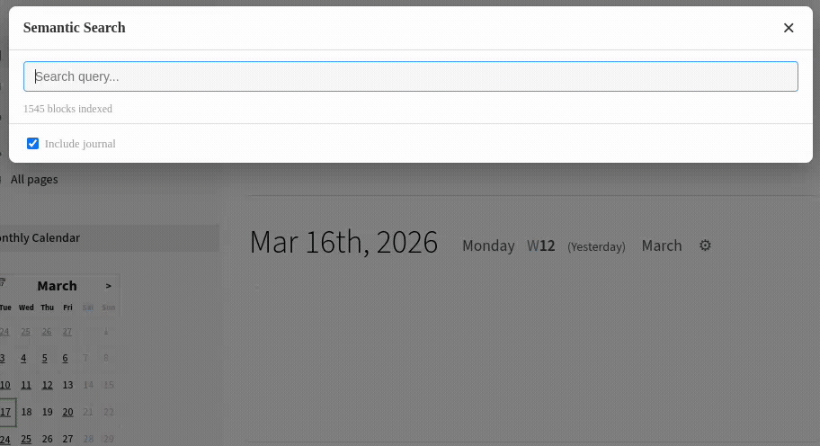

# Logseq Semantic Search

Search across all your Logseq blocks using text embeddings. Instead of matching exact keywords, semantic search finds blocks that are **conceptually similar** to your query.

Blocks are embedded with their full context — page name, page properties, and parent block hierarchy — so searching for a page topic or parent heading surfaces relevant child blocks.

## Requirements

An embedding API server. Either:

- **[Ollama](https://ollama.com/)** (default) — run locally with `ollama pull nomic-embed-text`
- Any **OpenAI-compatible** embedding API

### Running Ollama with Podman

If you prefer not to install Ollama directly, you can run it in a container:

```sh
podman run -d \
  --name ollama \
  -p 11434:11434 \
  -e OLLAMA_ORIGINS='*' \
  -v ollama:/root/.ollama \
  docker.io/ollama/ollama

# Pull the embedding model
podman exec ollama ollama pull nomic-embed-text
```

The container persists the model data in a named volume (`ollama`) so you won't need to re-download the model after restarts. To start it again later:

```sh
podman start ollama
```

## Installation

### From the Logseq Marketplace

1. In Logseq, go to **Plugins → Marketplace**
2. Search for "Semantic Search" and click **Install**

### From source

1. Build the plugin:

```sh
npm install
npm run build
```

2. In Logseq, enable Developer Mode so you can load plugins from a directory.

Do that here: **Settings > Advanced > Developer Mode**

3. In Logseq, go to **Plugins → Load unpacked plugin** and select this directory.

## Usage

Open the search modal with either the **Alt+K** keyboard shortcut or the toolbar search icon.



Type a query and results appear ranked by similarity. Click a result to navigate to that block. **Shift+click** (or **Shift+Enter**) opens the block in the right sidebar instead.

Hover over a result to reveal the **copy** button, or press **Ctrl+C** (**Cmd+C** on Mac) with a result selected, to copy a `((block reference))` to the clipboard.

The **Include journal** checkbox in the footer controls whether results from journal pages are shown.

Blocks are automatically indexed when the graph loads, and only changed blocks are re-embedded on subsequent runs. To rebuild the index from scratch, use the **Semantic Search: Rebuild index** command from the command palette (Ctrl/Cmd+Shift+P).

### Search tips

Semantic search matches meaning, not exact words. To get the best results:

- **Use natural language**: instead of `auth migration flag`, try `gradually rolling out the new authentication system`.
- **Describe what you're looking for**: `notes about debugging memory leaks` finds blocks about memory issues even if they never use the word "debugging".
- **Ask questions**: `why did we choose PostgreSQL?` works well when your notes contain the reasoning.
- **Be specific**: `meeting where we discussed the Q1 budget timeline` ranks better than just `meeting notes`.
- **Don't worry about exact phrasing**: synonyms like `cost`, `expense`, and `budget` all surface similar blocks.

## Settings

| Setting | Default | Description |
|---------|---------|-------------|
| API Endpoint | `http://localhost:11434` | Ollama or compatible server URL |
| API Format | `ollama` | `ollama` (`/api/embed`) or `openai` (`/v1/embeddings`) |
| Embedding Model | `nomic-embed-text` | Model name for embedding requests |
| Batch Size | `50` | Number of texts per API request |
| Top K Results | `20` | Maximum number of search results |
| Auto-index on Load | `true` | Automatically index when the graph loads |

## Support

This is a small utility built to reduce a bit of knowledge work friction
in Logseq. If it saves you time and helps you find something you'd lost,
you can drop a tip below. There is absolutely no pressure, but every coffee
is hugely appreciated!

<a href="https://www.buymeacoffee.com/twaugh" target="_blank"></a>

## Development

```sh
npm run dev      # Start dev server
npm test         # Run tests
npm run build    # Production build
```
